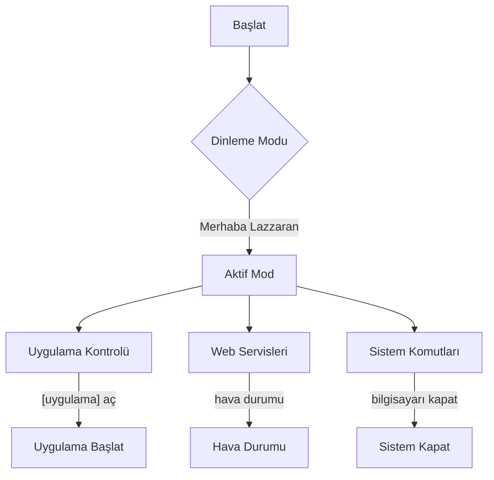
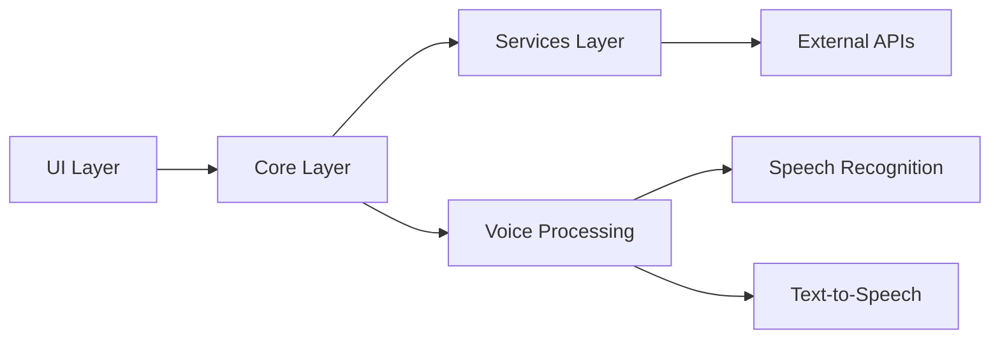

# 🎙️ Lazzaran - Türkçe Sesli Asistan

<div align="center">


[](LICENSE)
[](https://www.python.org/)
[](https://www.microsoft.com/windows)
[](https://github.com/ahmertsengol/Lazzaran/releases)
[](https://github.com/psf/black)
[](docs/)

*Lazzaran, yapay zeka destekli Türkçe sesli komutları anlayabilen, modern ve kullanıcı dostu bir masaüstü asistanıdır.*

[🚀 Özellikler](#-özellikler) • [💻 Kurulum](#-kurulum) • [📖 Kullanım](#-kullanım) • [🛠️ Geliştirme](#️-geliştirme) • [🤝 Katkıda Bulunma](#-katkıda-bulunma) • [📞 İletişim](#-i̇letişim)

</div>

---

## 📋 İçindekiler
- [🎯 Proje Hedefi](#-proje-hedefi)
- [✨ Özellikler](#-özellikler)
- [🔧 Sistem Gereksinimleri](#-sistem-gereksinimleri)
- [💻 Kurulum](#-kurulum)
- [📖 Kullanım](#-kullanım)
- [🏗️ Mimari](#️-mimari)
- [🛠️ Geliştirme](#️-geliştirme)
- [🧪 Test](#-test)
- [❓ SSS](#-sss)
- [📈 Yol Haritası](#-yol-haritası)
- [🤝 Katkıda Bulunma](#-katkıda-bulunma)
- [📄 Lisans](#-lisans)

## 🎯 Proje Hedefi

Lazzaran, Türkçe konuşan kullanıcılar için geliştirilmiş, yapay zeka destekli bir sesli asistan projesidir. Temel hedefimiz:

- 🗣️ Doğal dil işleme ile Türkçe komutları anlama
- 🖥️ Sistem uygulamalarını sesli kontrol etme
- 🌐 Web servisleri ile entegrasyon
- 🎯 Kullanıcı dostu arayüz
- 🔒 Güvenli ve performanslı çalışma

## ✨ Özellikler

### 🖥️ Uygulama Kontrolü

<details>
<summary><b>Sistem Uygulamaları</b></summary>

| Uygulama | Komutlar | Açıklama |
|----------|----------|-----------|
| 🧮 Hesap Makinesi | `hesap makinesini aç` | Windows hesap makinesini başlatır |
| 📝 Not Defteri | `not defterini aç` | Windows not defterini başlatır |
| 🎨 Paint | `paint aç` | Windows paint uygulamasını başlatır |
| 📊 Görev Yöneticisi | `görev yöneticisini aç` | Windows görev yöneticisini başlatır |
| 📂 Dosya Gezgini | `dosya gezginini aç` | Windows dosya gezginini başlatır |
| ⚙️ Denetim Masası | `denetim masasını aç` | Windows denetim masasını başlatır |

</details>

<details>
<summary><b>Popüler Uygulamalar</b></summary>

| Kategori | Uygulamalar | Komutlar |
|----------|-------------|-----------|
| 🌐 Web Tarayıcıları | Chrome, Firefox, Opera, Edge | `[tarayıcı adı]'ı aç` |
| 📊 Ofis Uygulamaları | Word, Excel, PowerPoint | `[uygulama adı]'ı aç` |
| 💬 İletişim | Discord, Teams, Telegram, WhatsApp | `[uygulama adı]'ı aç` |
| 🎵 Medya | Spotify, VLC | `[uygulama adı]'ı aç` |
| 🎮 Oyun | Steam, Epic Games | `[platform adı]'ı aç` |

</details>

### 🌐 Web Servisleri

| Servis | Komutlar | Özellikler |
|--------|----------|------------|
| 🌤️ Hava Durumu | `hava durumu nasıl` | Güncel hava durumu bilgisi |
| 📰 Haberler | `haberleri göster` | Güncel haber başlıkları |
| 🔍 Google | `google'da ara [arama]` | Web araması yapma |
| 🎥 YouTube | `youtube'da ara [arama]` | Video araması yapma |

### ⚡ Sistem Komutları

| Komut | Açıklama | Kullanım |
|-------|-----------|----------|
| 💻 Bilgisayarı Kapat | Sistemi kapatır | `bilgisayarı kapat` |
| 🔄 Yeniden Başlat | Sistemi yeniden başlatır | `yeniden başlat` |
| 📋 Uygulama Listesi | Çalışan uygulamaları listeler | `uygulamaları listele` |
| ❌ Uygulama Kapat | Belirtilen uygulamayı kapatır | `[uygulama adı]'ı kapat` |

## 🔧 Sistem Gereksinimleri

### Donanım
- 💽 CPU: 2.0 GHz veya üzeri
- 💾 RAM: 4GB minimum (8GB önerilen)
- 💿 Depolama: 500MB boş alan
- 🎤 Mikrofon
- 🔊 Hoparlör

### Yazılım
- 🪟 Windows 10/11
- 🐍 Python 3.8+
- 📦 Gerekli Python paketleri
- 🌐 İnternet bağlantısı

## 💻 Kurulum

### 1️⃣ Repository'yi Klonlayın
```bash
git clone https://github.com/ahmertsengol/Lazzaran.git
cd Lazzaran
```

### 2️⃣ Sanal Ortam Oluşturun
```bash
python -m venv venv
# Windows için
venv\Scripts\activate
# Linux/Mac için
source venv/bin/activate
```

### 3️⃣ Gereksinimleri Yükleyin
```bash
pip install -r requirements.txt
```

### 4️⃣ Ortam Değişkenlerini Ayarlayın
`.env` dosyasını oluşturun:
```env
WEATHER_API_KEY=your_api_key
NEWS_API_KEY=your_api_key
GEMINI_API_KEY=your_api_key
```

### 5️⃣ Uygulamayı Başlatın
```bash
python main.py
```

## 📖 Kullanım

### 🎯 Temel Komutlar



### 🎨 Arayüz Kullanımı

<div align="center">

</div>

1. 🎯 Başlat/Durdur: Ses tanımayı kontrol eder
2. 🔊 Ses Kontrolü: Asistanın sesini yönetir
3. 📋 Uygulama Listesi: Çalışan uygulamaları gösterir
4. 📝 Konsol: İşlem geçmişini gösterir

## 🏗️ Mimari



### 📁 Proje Yapısı

```
lazzaran/
├── core/               # Çekirdek modüller
│   ├── voice_assistant.py
│   ├── command_handler.py
│   └── services/
├── ui/                # Kullanıcı arayüzü
│   ├── display.py
│   └── assets/
├── config/            # Yapılandırma
│   ├── settings.py
│   └── config.yaml
├── services/          # Harici servisler
│   ├── weather.py
│   ├── news.py
│   └── ai_service.py
├── tests/             # Test dosyaları
└── docs/              # Dokümantasyon
```

## 🛠️ Geliştirme

### 🧪 Test Yazma
```python
def test_voice_recognition():
    assistant = VoiceAssistant()
    result = assistant.recognize_speech()
    assert result is not None
```

### 🔍 Kod Kalitesi
```bash
# Kod stilini kontrol et
black .

# Linting
pylint lazzaran/

# Testleri çalıştır
pytest
```

## ❓ SSS

<details>
<summary><b>API anahtarlarını nereden alabilirim?</b></summary>

- 🌤️ Weather API: [OpenWeatherMap](https://openweathermap.org/api)
- 📰 News API: [NewsAPI](https://newsapi.org)
- 🤖 Gemini API: [Google AI Studio](https://ai.google.dev/)
</details>

<details>
<summary><b>Ses tanıma çalışmıyor?</b></summary>

1. Mikrofonunuzun bağlı olduğunu kontrol edin
2. PyAudio kurulumunu kontrol edin
3. Ses seviyelerini kontrol edin
</details>

## 📈 Yol Haritası

- [ ] 🌍 Çoklu dil desteği
- [ ] 📱 Mobil uygulama
- [ ] 📅 Takvim entegrasyonu
- [ ] 🎯 Özelleştirilebilir komutlar
- [ ] 🤖 Gelişmiş AI özellikleri

## 🤝 Katkıda Bulunma

1. Fork edin
2. Feature branch oluşturun (`git checkout -b feature/AmazingFeature`)
3. Değişikliklerinizi commit edin (`git commit -m 'Add some AmazingFeature'`)
4. Branch'inizi push edin (`git push origin feature/AmazingFeature`)
5. Pull Request açın

## 📄 Lisans

Bu proje MIT lisansı altında lisanslanmıştır. Detaylar için [LICENSE](LICENSE) dosyasına bakın.

## 📞 İletişim

Ahmet Mert Şengöl
- 📧 Email: [21sandn21@gmail.com](mailto:21sandn21@gmail.com)
- 🐦 Twitter: [@ahmertsengol](https://twitter.com/ahmertsengol)
- 💼 LinkedIn: [Ahmet Mert Şengöl](www.linkedin.com/in/ahmertsengol)
- 🌐 Website: [ahmertsengol.com](https://ahmertsengol.com)

## 🌟 Teşekkürler

Bu projeye katkıda bulunan herkese teşekkürler!

<div align="center">

</div>

---

<div align="center">
Made with ❤️ by <a href="https://github.com/ahmertsengol">Ahmet Mert Şengöl</a>

<a href="#-lazzaran---türkçe-sesli-asistan">⬆️ Başa Dön</a>
</div>

